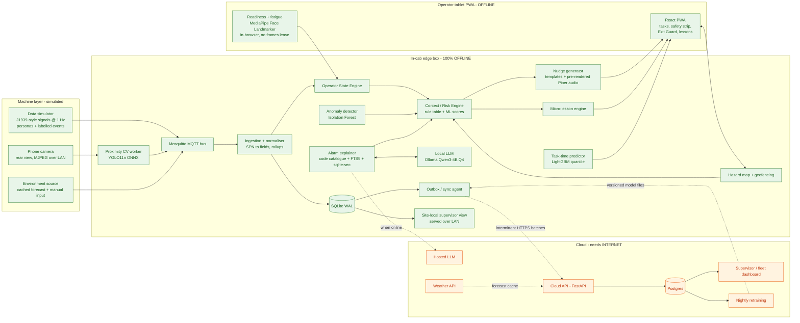
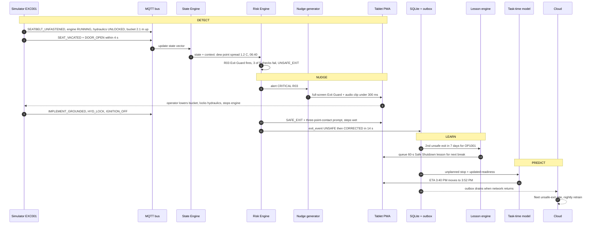

# Operator Companion — High-Level Design
*Smart Operator Assistant for CAT machinery · Hackathon HLD v1*

> **Assumptions I had to make (fill-ins were blank):** ~48 h of build time, team skills = Python/ML + React/TypeScript + FastAPI. If you have longer, stretch the middle milestones — don't add features. "Operator Companion" is a working name; avoid putting "CAT" in the product name for trademark reasons.

---

## 1. Executive summary

**The pitch (5 lines)**

1. Operators get injured most often not *while digging* but *between* actions — climbing out with the engine running, leaving a raised bucket, swapping an attachment, starting a shift tired.
2. Operator Companion is an in-cab AI companion that knows what the operator, machine and site are doing, and checks whether the machine and person are in a safe state **for the next action they're about to take**.
3. It closes the loop: **DETECT** (telemetry + camera + environment) → **NUDGE** (one clear spoken instruction) → **LEARN** (a 60-second lesson built from that exact event) → **PREDICT** (personal task ETAs, risk and productivity).
4. Everything safety-critical runs on the machine with zero internet; the cloud only adds fleet views, better language models and retraining.
5. Built on real standards (SAE J1939, ISO 15143-3/AEMP 2.0) and real CAT 320 / 950 GC specs, so it drops into Product Link-style data, not a toy schema.

**Why transition safety wins**

Every other team will build "seatbelt off → beep" and an idle chart. That's monitoring. Transition safety is a *reasoning* problem: "seatbelt off" means nothing on its own; seatbelt off + seat vacated + hydraulics unlocked + bucket 2 m in the air + wet steps is a specific, preventable fall-or-crush scenario with a specific correct action. It gives you one crisp hero demo (Exit Guard), it maps directly to known injury causes (mount/dismount falls, unsecured implements), it's genuinely underserved by operator-facing tools (VisionLink and Cat Inspect are owner/fleet-facing and after the fact), and it naturally ties every module together — lessons are delivered at transitions, ETAs update at transitions, hazards are announced at transitions.

---

## 2. Scope triage

Verdicts: **MVP** = must be in the live demo · **Stretch** = only if MVP is solid by checkpoint #2 · **It2** = Iteration 2 (pitch it, don't build) · **Cut**.

| # | Feature | Verdict | Justification / final call |
|---|---|---|---|
| 1 | Daily Task Dashboard | **MVP** | Tasks, machine, location, delays/backlog, predicted ETA from #2. No live progress (team decision — correct, it needs payload integration you can't fake credibly). |
| 2 | Personalised task-time ETA | **MVP** | Core "PREDICT" piece. LightGBM quantile model; show P50 ETA + likely range. |
| 3 | Operator State Engine | **MVP** | The core. Deterministic state vector + rule-based classification (see §4). |
| 4 | Fuel efficiency | **MVP** | Keep, but fix the metric: your 1.9 L/cycle "abnormal" is mostly idle fuel divided by ~0 cycles. Report *fuel per load over productive time* + *idle fuel share* separately (§6.10). |
| 5 | Productivity | **MVP-lite** | Cycles/hour, loads/hour, idle ratio, vs own history. No separate screen — lives in scorecard. |
| 6 | Idle buckets (3–6 / 6–9 / 9+ min) | **MVP** | Pure event logic. Sub-3-min pauses are truck swaps — don't count them. |
| 7 | Anomaly detection (Isolation Forest) | **MVP** | Keep, but drop raw engine hours as a feature (it's machine age, not behaviour) and replace binary seatbelt with *minutes unfastened while running*. |
| 8 | Live Safety Panel | **MVP** | Always-visible strip on every screen, not just its own page. |
| 9 | Seatbelt monitoring | **MVP** | Trivial; folded into rules. |
| 10 | Context-aware seatbelt alerts | **MVP** | Cheap — it's two rows in the rule table (belt off while moving = critical; belt off while locked & stationary = silent chip). Also add **belt-bypass detection** (belt fastened but seat empty). |
| 12 | Exit Guard | **MVP — hero** | The demo centrepiece. Advisory only, never an interlock. |
| 12.1 | Safe Exit State Detection | **MVP — merged into 12** | Same component; 12 is the trigger, 12.1 is the check list. Don't build two things. |
| 14 | Mount/dismount tracking | **MVP-lite (keep)** | Worth it because it's free: it falls out of Exit Guard events and gives you the KPI judges love — *unsafe-exit rate per 100 exits*. Don't build a "time outside" UI; just log it. |
| 15 | Three-point-contact reminder | **MVP (keep)** | One rule + one audio clip. Mount/dismount falls are a leading operator injury; wet/dew detection from temp + RH is easy. Near-zero cost, high story value. |
| 16 | Attachment Handshake (photo CV) | **Replace → "Coupler Confirm" (Stretch)** | Photo CV of coupler pins is overkill and unreliable in mud. Instead: coupler-cycle event → required **ground-press test** detected from hydraulic pressure (bucket curled and pressed on ground ≥ 2 s) + one-tap visual confirmation. Uses an assumed coupler-lock sensor signal. Matches real coupler-safety practice. |
| 18 | Proximity (phone cam + YOLO) | **MVP** | Pretrained person class only, no custom training. Zones use the 320's real tail-swing radius. |
| 19 | Hazard pins | **MVP — merged with incident button** | One "Report" button → type grid (hazard / near miss / incident). |
| 20 | Site Memory / geofence voice | **MVP-lite** | Pins persist on the edge box; second device (phone as "Operator B") gets the voice warning. Cloud fan-out = Stretch. |
| 22 | Shift-start readiness (~20 s) | **MVP (redesigned)** | 20 s of camera is too short for meaningful PERCLOS. Primary signals: reaction test + prior-sleep self-report + heat. Camera long-blink count is a secondary signal. Output Green/Yellow/Red, advisory. |
| 23 | Camera fatigue (PERCLOS, MediaPipe) | **Stretch (high value)** | In-shift, 60-s rolling window — where PERCLOS actually makes sense. ~½ day with MediaPipe in-browser. Very demo-able; do it if the frontend person is ahead. |
| 24 | Reaction-time tap test | **MVP** | 10 stimuli, ~20 s. Compared against the operator's own baseline. |
| 25 | Heat risk | **MVP** | Heat index + estimated WBGT from temp/RH — pure formulas. |
| 28 | Alarm Explainer | **MVP** | What happened / why it matters / what to do — from a structured code catalogue. Works with zero AI. |
| 29 | RAG over manuals | **MVP-lite** | Small curated corpus (~30–50 codes + walkaround/shutdown sections). You don't have licensed CAT SIS manuals — say so; don't pretend. |
| 30 | Voice diagnostic Q&A | **Stretch** | Typed Q&A in MVP; push-to-talk with whisper.cpp as stretch. |
| 31 | Action classification | **MVP (by construction)** | The action class is a *field in the catalogue*, never LLM-generated. If there's no documented class → "Not documented — contact supervisor." |
| 32 | Contextual nudges | **MVP** | Template + slot filling, pre-rendered audio. Not LLM-generated in real time (latency + can't be pre-validated). |
| 33 | Voice-first assistant | **It2** | Per team decision. |
| 34 | Multilingual (EN/HI/TA) | **It2** | Per team decision. Design strings as i18n keys from day 1 so it's credible. |
| 35 | Training hub | **MVP-lite** | ~6 micro-lessons (cards + MCQ), 1–2 short videos max. |
| 35a | Instructor booking | **Cut** | CRUD with no AI story; judges won't care. |
| 35b | 3D simulation module | **Cut** | Weeks of work. "Replay the Incident" is your simulation. |
| 36 | Auto micro-lessons | **MVP** | Rule → lesson mapping, delivered at the next safe moment (engine off / break). |
| 37 | Replay the Incident (MCQ) | **MVP** | 3 scripted scenarios, one generated from the live demo's unsafe exit. |
| 39 | Context-matched lessons | **Stretch** | Nearest-neighbour over a scenario library's state vectors. Pitch-able; build last. |
| 7a | Scorecard | **MVP-lite** | One screen for operator, one table for supervisor. |
| 7b | Veteran benchmark / ghost comparison | **Stretch** | Cheap on simulated data: overlay your cycles/hour vs veteran persona. |
| 7c | Rewards | **It2 (with caveat)** | Never reward "zero incidents" — it teaches people to stop reporting. Reward near-miss reports and lesson completion. |
| 1b | Live "current progress" | **Cut** | Team decision; agreed. |

---

## 3. Architecture

### 3.1 System architecture (offline vs internet)

Green = runs fully offline in the cab/site. Orange = needs internet; degrades gracefully.



**Three tiers, one rule:** in-cab edge (always works) → site LAN (hazard sharing between machines on site Wi-Fi, no internet needed) → cloud (fleet, retraining). For the hackathon, the laptop plays both the in-cab edge and the site gateway.

### 3.2 Closed loop for one scenario: unsafe exit



---

## 4. Component breakdown

### 4.1 Data simulator
| | |
|---|---|
| Responsibility | Generate realistic, labelled machine/operator/environment data; replay scripted demo scenarios on command. |
| Inputs | Config: machines, operators + personas, site, task schedule, weather profile, scenario scripts; organizer sample rows as anchors. |
| Outputs | 1 Hz telemetry (MQTT), discrete events, DTCs, env observations; historical dataset (Parquet) for training; hidden `sim_label` for evaluation. |
| Logic | Per-machine finite-state machine at 1 Hz: `OFF → START → IDLE ⇄ WORK(dig → swing-loaded → dump → swing-empty) ⇄ TRAVEL ⇄ EXIT`. Physics-lite: fuel rate = f(engine load); temps follow first-order lag toward load/ambient targets. Details in §6.13. |
| Runs | Separate process on the laptop (stands in for the CAN gateway). |
| Offline | Fully offline. |
| Failure mode | If it dies, edge shows "Machine data lost" (stale > 3 s) — which is itself a tested state. Demo control API: `POST /sim/scenario`. |

### 4.2 Ingestion + event bus
| | |
|---|---|
| Responsibility | Normalise raw signals into the canonical schema, derive events from state changes, write to SQLite, build 1-min and 1-h rollups. |
| Inputs | MQTT `cat/{site}/{machine}/raw`, `…/cv/proximity`, `…/env`. |
| Outputs | `…/telemetry` (normalised), `…/event`, rollup rows, idle episodes. |
| Logic | Schema validation (pydantic); edge detection (belt ON→OFF, ignition, lockout); debounce 500 ms on switches; idle-episode segmentation; hourly window in the organizer's exact schema. |
| Runs | Edge. |
| Offline | Fully offline. |
| Failure mode | Malformed frame → dropped + counter; stale stream > 3 s → `DATA_STALE` event, UI greys values (never shows old values as live). |

### 4.3 Operator State Engine (core)
| | |
|---|---|
| Responsibility | Maintain one current state vector per machine+operator and classify it: **Productive / Attention Required / Potentially Unsafe** (+ Parked/Off). |
| Inputs | Normalised telemetry, events, readiness/fatigue scores, proximity, geofence hits, active DTCs, env. |
| Outputs | `state/{machine}` (1 Hz, on change), with the list of contributing rule IDs (explainability). |
| Logic | Rules, not ML. Classification = highest active alert level: any CRITICAL → Potentially Unsafe; any WARNING/CAUTION or productivity flag → Attention Required; else Productive. Hysteresis: must be clear for 10 s to step down. |
| Runs | Edge, in the FastAPI process (asyncio task). |
| Offline | Fully offline. |
| Failure mode | Missing signal → that rule evaluates as *unknown*, not *safe*; UI shows "Seat sensor unavailable" rather than a green light. |

### 4.4 Context / Risk Engine (rules + ML)
| | |
|---|---|
| Responsibility | Evaluate the rule table every tick; merge ML scores; emit alerts with level, message key, cooldown; manage alert fatigue. |
| Inputs | State vector + context (weather, time, task type, hazard zones, operator history). |
| Outputs | `alert/{machine}`, `nudge/{machine}`, exit events, supervisor escalations. |
| Logic | Declarative YAML rule table (below) evaluated in Python; ML scores (anomaly, fatigue) enter as *inputs to rules*, never as direct alarms. |
| Runs | Edge. |
| Offline | Fully offline. |
| Failure mode | Rule exception → rule disabled + logged, others keep running; watchdog restarts engine in < 2 s with state rehydrated from SQLite. |

**Derived predicates used by rules**

- `running` = engine_state == RUNNING
- `active` = travel_kmh > 0.3 OR abs(swing_deg_s) > 1 OR hyd_pump_press > 4,000 kPa (above standby) OR joystick activity in last 5 s
- `idle` = running AND NOT active for ≥ 30 s
- `grounded` = bucket_height_m ≤ 0.3
- `exit_intent` (strong) = running AND (seat_occupied false > 2 s OR (seatbelt OFF AND door_open))
- `exit_hint` (weak) = running AND seatbelt ON→OFF in last 10 s
- `wet` = rain_flag OR (RH ≥ 90% AND temp − dew point ≤ 2 °C) OR ground_condition == wet
- `lift_mode` = excavator lift mode ON or task_type == LIFTING

**Rule table v1**

| ID | Condition | Level | State | Operator action (nudge) | Cooldown |
|---|---|---|---|---|---|
| R01 | seatbelt OFF AND active | CRITICAL | Unsafe | Audio: "Seatbelt off while operating — stop and fasten your belt." | 20 s, repeat while true |
| R02 | seatbelt OFF AND running AND hyd LOCKED AND NOT active AND seat_occupied | INFO → CAUTION after 5 min | Attention | Silent chip; after 5 min soft chime. | 5 min |
| R03 | exit_intent AND (hyd UNLOCKED OR NOT grounded OR (loader AND parking_brake OFF)) | CRITICAL | Unsafe | **Exit Guard** full-screen: "Before exiting: lower the bucket, lock hydraulics, stop the engine." Live checklist ticks off. | none while true |
| R04 | exit_intent AND all R03 checks pass AND running | CAUTION | Attention | "Machine secured. Engine still running — shut down if you'll be away more than 5 minutes." | per exit |
| R05 | exit_hint AND NOT exit_intent | INFO | — | Pre-warn chip showing checklist status (catches the exit early). | per event |
| R06 | exit (any) AND wet | CAUTION | — | Audio: "Steps may be slippery — use three points of contact." | per exit |
| R07 | seatbelt FASTENED AND seat_occupied false > 5 s AND running | WARNING | Attention | Belt-bypass: "Seatbelt latched with no one in the seat." + supervisor log | 30 min |
| R08 | idle episode ≥ 9 min AND seatbelt OFF AND running | CAUTION | Attention | "If you're leaving, shut down the engine and secure the attachment." | 15 min |
| R09 | idle episode ≥ 9 min (long) | INFO | Attention | Productivity flag, logged. Tag reason chip (waiting truck / break / other). | per episode |
| R10 | pitch > 15° OR roll > 10° (roll > 5° if lift_mode) | CAUTION | Attention | "Machine on a slope — check stability." | 60 s |
| R11 | pitch > 25° OR roll > 15° | CRITICAL | Unsafe | "Tip-over risk. Stop, lower the implement." | 20 s |
| R12 | person < 3.8 m (tail swing 2.83 m + 1 m) AND active | CRITICAL | Unsafe | "Person behind machine — stop swinging." | 5 s |
| R13 | person 3.8–8 m AND active | WARNING | Attention | Visual + tone. | 15 s |
| R14 | enter hazard geofence | WARNING | Attention | Type-specific voice ("Overhead power line ahead — keep boom below 5 m"). | per zone entry |
| R15 | power-line zone AND boom_tip_height > line_clearance − 3 m | CRITICAL | Unsafe | "Boom too close to power line." | 5 s |
| R16 | active DTC with action_class STOP | CRITICAL | Unsafe | Alarm Explainer card, "Stop and follow shutdown procedure." | per code |
| R17 | active DTC with action_class MONITOR | CAUTION | Attention | Alarm Explainer card. | per code |
| R18 | coolant ≥ 105 °C OR hydraulic oil ≥ 95 °C (derived, pre-DTC) | CAUTION | Attention | "Temperatures rising — reduce load, check cooler for debris." | 10 min |
| R19 | PERCLOS(60 s) > 15% OR ≥ 2 long blinks/min | WARNING | Attention | "Signs of fatigue — take a 10-minute break at a safe spot." | 10 min |
| R20 | readiness == RED at shift start | WARNING | Attention | Suggest break + retest; notify supervisor. Never blocks start. | per shift |
| R21 | WBGT_est ≥ 28 °C AND (outside cab OR cab AC off) | CAUTION | — | Hydration + shade reminder. | 45 min |
| R22 | coupler cycled AND no ground-press test within 3 min AND boom raised | WARNING | Attention | "Attachment lock not verified — do the ground-press test." | 60 s |
| R23 | anomaly_score in top 3% for this machine model | INFO | Attention | No audio. Supervisor digest + review queue. | 1 h |
| R24 | fuel per productive hour > 1.4× operator's 14-day baseline | INFO | Attention | Efficiency tip at next pause (e.g., power mode / high idle RPM). | 1 day |

**Alert-fatigue controls:** max one audio message per 30 s except CRITICAL; a higher-level active alert suppresses lower ones on the same subject; CRITICAL audio never suppressed; every alert has "Why?" showing the rule and live values; track *alerts per operating hour* as a first-class metric (target < 4/h non-critical).

### 4.5 Anomaly detector
| | |
|---|---|
| Responsibility | Flag unusual multivariate behaviour that rules don't cover (e.g., normal cycles but 1.6× fuel). |
| Inputs | Hourly window features (§7.1). |
| Outputs | `anomaly_score` 0–1, top-3 contributing features with deviations. |
| Logic | scikit-learn IsolationForest, one model per machine family, contamination 0.03. Explanation via robust z-score vs the operator's own 14-day baseline. |
| Runs | Inference on edge (joblib, < 5 ms); training in cloud/laptop. |
| Offline | Inference offline; retraining only when online. |
| Failure mode | Model file missing/corrupt → rules still run, "Anomaly model unavailable" badge. |

### 4.6 Task-time predictor
| | |
|---|---|
| Responsibility | Predict duration for this operator + task + machine + conditions → ETA with range. |
| Inputs | Task (type, quantity, soil), machine/attachment, operator history, readiness, weather, time of day, hours into shift. |
| Outputs | P50 and P90 duration, ETA clock time, top 3 drivers ("wet clay +12%"). |
| Logic | LightGBM quantile regression (α = 0.5, 0.9) on log-duration. Cold-start fallback: operator → experience cohort → task-type baseline. |
| Runs | Edge inference; cloud retraining. |
| Offline | Fully offline with last cached forecast. |
| Failure mode | No model → task-type baseline rate with wide band, labelled "Estimate (generic)". |

### 4.7 Fatigue / readiness module
| | |
|---|---|
| Responsibility | Shift-start readiness (G/Y/R) and optional in-shift drowsiness signal. |
| Inputs | Reaction test taps, self-report (sleep hours last 24 h/48 h, 1–5 feeling), camera blendshapes, env (temp, RH). |
| Outputs | `readiness_check` record, `fatigue_sample` stream (PERCLOS, long blinks). |
| Logic | See §7.4. MediaPipe Face Landmarker (tasks-vision, WASM) in the browser; only numbers leave the browser. |
| Runs | Tablet browser (camera) + edge (scoring, baseline). |
| Offline | Fully offline. |
| Failure mode | No camera/consent → score computed from reaction + self-report + heat; UI states "camera not used". Never blocks operation. |

### 4.8 Proximity CV module
| | |
|---|---|
| Responsibility | Detect people behind/around the machine; estimate distance band. |
| Inputs | Phone camera MJPEG stream (Android "IP Webcam" app) over LAN; or simulated radar channel. |
| Outputs | `cv/proximity`: nearest person distance (m), sector, confidence. |
| Logic | YOLO11n (Ultralytics) → ONNX Runtime CPU, imgsz 416, person class only, conf ≥ 0.45, 3-of-5 frame persistence. Distance from box height with pinhole model (assume 1.7 m person, focal length from one-time calibration). Expect ±30%; zones are wide on purpose. |
| Runs | Edge (separate worker process). |
| Offline | Fully offline. |
| Failure mode | Camera lost / low light / lens dirty (low mean brightness or blur variance) → "Rear camera unavailable" + fall back to simulated sensor channel. Never silently "no person". |

### 4.9 Alarm explainer + RAG
| | |
|---|---|
| Responsibility | Turn SPN/FMI or CAT event codes into What happened / Why it matters / What to do + action class; answer typed questions. |
| Inputs | Active DTCs, operator question, machine model. |
| Outputs | Explanation card, action class, source citation (doc + section). |
| Logic | (1) Exact lookup in `diagnostic_code` table (deterministic, always offline). (2) For questions: hybrid retrieval — SQLite FTS5 (BM25, catches exact codes) + sqlite-vec (bge-small-en-v1.5 embeddings), top-4 chunks. (3) LLM only rephrases retrieved text; action class copied from catalogue. (4) Retrieval score below threshold → "No documented guidance found. Contact your supervisor." |
| Runs | Edge (Ollama local LLM); cloud LLM when online for better phrasing. |
| Offline | Catalogue cards 100% offline without any LLM; Q&A offline via local model (~2–5 s). |
| Failure mode | LLM down → templated card from catalogue fields. LLM is never on the safety path. |

### 4.10 Nudge generator
| | |
|---|---|
| Responsibility | Convert alerts into short, consistent operator messages (visual + audio). |
| Inputs | Alert (rule ID, slots: minutes idle, failed checks, hazard type). |
| Outputs | Nudge text (i18n key + slots), audio clip ID, display mode (chip / banner / full screen). |
| Logic | Template per rule. All fixed phrases pre-rendered with Piper TTS at build time → instant, offline playback; slot phrases ("55 minutes") assembled from number clips or Piper at runtime. |
| Runs | Edge (selection) + tablet (playback). |
| Offline | Fully offline. |
| Failure mode | Audio fails → visual + device vibration; CRITICAL also uses a distinct tone pattern. |

### 4.11 Training / micro-lesson engine
| | |
|---|---|
| Responsibility | Assign lessons from detected behaviour; deliver at safe moments; run Replay MCQs; track completion. |
| Inputs | Alerts/exit events per operator, lesson catalogue (trigger rule IDs), machine state. |
| Outputs | `lesson_assignment` rows, lesson UI. |
| Logic | Assign when: 1 CRITICAL event, or same rule ≥ 2× in 7 days. Deliver only when engine OFF, at a break, or shift end — **never while the machine is active** (that's a distraction hazard). Replay: scenario = frozen state vector + 3–4 choices + explanation. |
| Runs | Edge. |
| Offline | Fully offline (content bundled; videos cached by PWA). |
| Failure mode | Missing content → generic lesson for the rule family. |

### 4.12 Hazard map + geofencing
| | |
|---|---|
| Responsibility | Operator-reported hazard pins, persistent site memory, entry warnings. |
| Inputs | Pins from tablet, machine position (simulated local ENU metres), pins from other devices via site LAN/cloud. |
| Outputs | `hazard/{site}` (retained MQTT), geofence enter/exit events. |
| Logic | Leaflet with `CRS.Simple` over a site-plan image; point-in-polygon/radius with turf.js (client) + shapely (edge). Pin = point + radius (default 10 m) or polygon. Auto-expire soft ground/worker zones after 24 h unless re-confirmed. |
| Runs | Edge + tablet. |
| Offline | Fully offline per machine; site-wide via LAN; fleet-wide when online. |
| Failure mode | GPS stale > 10 s → "Position unknown — hazard alerts paused" (visible, not silent). |

### 4.13 Sync service
| | |
|---|---|
| Responsibility | Reliable, idempotent edge ↔ cloud sync over intermittent links. |
| Inputs | `sync_queue` (outbox), cloud change feeds. |
| Outputs | Pushed batches; pulled hazards/tasks/lessons/model files. |
| Logic | Transactional outbox: every write that must reach the cloud inserts a queue row in the same SQLite transaction. IDs are UUIDv7 (time-ordered, globally unique). Push batches of ≤ 500, gzip, exponential backoff (5 s → 5 min). Priorities: P0 incidents + critical alerts, P1 events, P2 rollups/scorecards, P3 1-min telemetry. Raw 1 Hz never leaves the machine. Pull by cursor. Conflicts: events are immutable (no conflicts); hazard pins last-writer-wins by `version` + tombstones; tasks are cloud-authoritative except status. |
| Runs | Edge agent + cloud endpoint. |
| Offline | Queue grows; UI shows "Offline · 213 items waiting". |
| Failure mode | Duplicate push → cloud upserts by ID (idempotent). Queue > 50k rows → drop P3 oldest first, never P0/P1. |

### 4.14 Auth / operator login
| | |
|---|---|
| Responsibility | Identify operator per shift without internet. |
| Inputs | Badge QR scan (tablet camera) + 4-digit PIN. |
| Outputs | Offline-verifiable JWT (edge-signed), shift start. |
| Logic | Cached roster with bcrypt PIN hashes synced when online; roles operator / supervisor / admin. Supervisor override uses their own PIN. |
| Runs | Edge. |
| Offline | Fully offline. |
| Failure mode | Unknown badge → "Guest operator" mode; all data tagged unverified. |

### 4.15 Supervisor dashboard
| | |
|---|---|
| Responsibility | Fleet/site view: machine states, alerts, incidents, readiness, scorecards, hazards, anomaly review. |
| Inputs | Cloud Postgres (fleet) or edge SQLite (site-local over LAN). |
| Outputs | Acknowledgements, hazard approvals, anomaly labels (feedback for retraining), task assignments. |
| Logic | Same React codebase, `/supervisor` routes; polling every 10 s (websocket optional). |
| Runs | Cloud; site-local copy on edge. |
| Offline | Site-local view works on LAN; fleet view shows "last synced 14 min ago". |
| Failure mode | Stale data is always timestamped, never presented as live. |

---

## 5. Tech stack

| Layer | Choice | Why (offline-first, 3 people) |
|---|---|---|
| Tablet UI | **React + Vite + TypeScript + Tailwind, PWA via vite-plugin-pwa (Workbox)** | One codebase for tablet, phone, laptop; installable; app shell + lessons cached offline. Zustand for state, Recharts for charts. |
| Edge backend | **Python 3.11 + FastAPI + uvicorn**, single process, asyncio tasks, WebSocket to UI | ML is Python; one language for backend + ML people. |
| Message bus | **Mosquitto (MQTT 3.1.1/5)** + aiomqtt | Telematics-native, tiny, retained messages for hazards. Kafka/RabbitMQ = overkill. |
| On-device DB | **SQLite (WAL) + FTS5 + sqlite-vec**, SQLModel | One file holds telemetry, events, vectors, full-text. Zero ops. |
| Sync | **Custom outbox/inbox over HTTPS** (UUIDv7, idempotent upserts, cursors) | ~200 lines. CouchDB/PouchDB, ElectricSQL, CRDT libs = overkill and a new thing to debug at 3 a.m. |
| Cloud | **FastAPI + Postgres** (Supabase/Neon free tier, or a second laptop) | Same models as edge. |
| ML | **scikit-learn** (IsolationForest), **LightGBM** (quantile), pandas, joblib | Fast to train on laptop, milliseconds to infer, explainable. |
| CV — proximity | **YOLO11n (Ultralytics) → ONNX Runtime CPU**, person class | Pretrained, ~15–30 FPS at 416 px on a laptop CPU. Licence note: Ultralytics is AGPL-3.0 — fine for a hackathon; for a product swap to an Apache-2.0 detector (e.g., RT-DETR or MediaPipe EfficientDet-Lite). |
| CV — face | **MediaPipe Face Landmarker (tasks-vision JS/WASM)**, blendshapes `eyeBlinkLeft/Right` | Runs in the browser; frames never leave the tablet (privacy story). |
| Local LLM | **Ollama + Qwen3-4B-Instruct-2507, Q4_K_M (~2.5 GB RAM)**; fallback Llama-3.2-3B-Instruct Q4 | Good instruction-following at 4B; ~8–15 tok/s on laptop CPU; runs on a Jetson Orin-class edge box. Only for rephrasing/Q&A. |
| Cloud LLM | Any hosted model via an OpenAI-compatible endpoint (Groq/OpenRouter/whatever credits you have) | Better phrasing when online; same prompt + retrieved context. |
| Embeddings | **BAAI/bge-small-en-v1.5 via fastembed (ONNX, 384-d)**; It2: multilingual-e5-small | No PyTorch on edge; ~130 MB. |
| Vector store | **sqlite-vec** (+ FTS5 for BM25) | Same DB file; hybrid search catches exact codes like "SPN 110 FMI 0". |
| TTS | **Piper** (en_US-lessac-medium) — fixed alerts pre-rendered to WAV at build time | Instant, deterministic, offline. Browser `speechSynthesis` as last resort. |
| STT (stretch/It2) | **whisper.cpp** base.en (or faster-whisper small int8) | Offline push-to-talk. |
| Maps / geofence | **Leaflet (CRS.Simple on site-plan image) + turf.js + shapely** | No tile server needed; site plans are what sites actually have. |
| Packaging | **docker compose** (mosquitto, edge-api, cv-worker, ollama, simulator) on the laptop; PWA installed on tablet/phone from the LAN | One command demo. Kubernetes = overkill. |
| Demo network | **Travel router with no WAN** (LAN) + separate internet uplink you can unplug | Lets you "pull the cable" without killing tablet ↔ edge. |
| Production target (pitch only) | Rugged tablet (e.g., Samsung Galaxy Tab Active5, glove mode) + edge box (e.g., Jetson Orin Nano 8 GB) + read-only J1939 CAN gateway | Credible path, not built. |

### 5.1 Online vs offline capability matrix

| Feature | Offline (in-cab) | Online adds | Degradation when offline |
|---|---|---|---|
| Task dashboard | Cached tasks for shift, local status updates | New assignments, re-plans | Shows "tasks as of 06:10" |
| Task ETA | Local model + cached forecast | Fresh weather, retrained model | Uses last forecast; band widens |
| Operator State / rules | Full | — | None |
| Seatbelt, Exit Guard, 3-point | Full | — | None |
| Idle, fuel, productivity | Full | Fleet comparison | Compares vs own history only |
| Anomaly detection | Full inference | Retraining, fleet baselines | Model version frozen |
| Proximity CV | Full | — | None |
| Readiness / fatigue | Full | Supervisor notified live | Red result queued as P0 |
| Heat risk | From cached forecast / cab sensor / manual input | Live weather API | Uses forecast; labels source |
| Hazard pins (own machine + site LAN) | Full | Fleet/site-wide propagation | Other sites don't see new pins yet |
| Alarm explainer cards | Full (catalogue) | — | None |
| Manual Q&A (RAG) | Local LLM, slower | Hosted LLM, better phrasing | 2–5 s answers, simpler language |
| Nudges + audio | Full (pre-rendered) | — | None |
| Micro-lessons, Replay | Full (bundled) | New content | New lessons wait for sync |
| Scorecard | Own data | Site percentile, veteran benchmark | Shows personal trend only |
| Incident / near-miss report | Full, queued P0 | Supervisor gets it immediately | Delivered on reconnect |
| Supervisor dashboard | Site-local over LAN | Fleet-wide | "Last synced" timestamp |

---

## 6. Data model

**Source codes:** `CAN` = SAE J1939 on machine bus (SPN given) · `PL` = Product Link / ISO 15143-3 (AEMP 2.0) field · `SENS` = assumed extra sensor (IMU, seat switch, coupler, camera) · `OP` = operator input · `DER` = derived by us · `EXT` = external API · `CFG` = configuration/master data · `SIM` = simulator-only label.
**R/D:** R = raw, D = derived.

### 6.0 Reference specs used (real machines)

| Spec | CAT 320 (excavator) | CAT 950 GC (wheel loader) |
|---|---|---|
| Engine | Cat C4.4, 128.5 kW net (ISO 9249), advertised at 2,200 rpm | Cat C7.1, 168 kW net, max power at 1,700 rpm |
| Operating weight | 22,600 kg | 18,849 kg |
| Bucket | 1.19 m³ HD (standard config) | 2.9–4.4 m³ |
| Fuel / DEF tank | 345 L / 39 L | 290 L / 16 L |
| Max implement pressure | 35,000 kPa | 27,900 kPa |
| Other | Swing 11.25 rpm, tail swing radius 2.83 m (9.3 ft), hydraulic tank 115 L | Hydraulic total cycle 9.4 s; has auto engine idle shutdown |
| Standard tech worth citing | Cat Payload, Cat Grade with 2D (boom/stick/bucket IMUs — so implement position is a real signal), Product Link | Product Link, idle management |

**Simulator operating assumptions** (calibrated to organizer rows, §6.12 — label these as assumptions in the pitch):

| Parameter | CAT 320 | CAT 950 GC |
|---|---|---|
| Low idle / working / high idle rpm | ~1,000 / 1,600–2,000 / ~2,200 | ~800 / 1,400–1,800 / ~2,200 |
| Fuel at low idle | 1.8–2.5 L/h | 2.5–3.5 L/h |
| Fuel light / medium / heavy work | 7–10 / 11–14 / 15–19 L/h | 12–15 / 16–19 / 20–25 L/h |
| Cycle (pass) time | 15–22 s (90° truck loading), 25–35 s trenching | 30–45 s short load-and-carry |
| Payload per pass | 1.6–2.3 t (1.19 m³ × fill factor × 1.4–1.9 t/m³ loose) | 4.0–6.5 t |
| Coolant temp | normal 82–95 °C · caution ≥ 105 · critical ≥ 110 | same |
| Hydraulic oil temp | normal 45–80 °C · caution ≥ 95 · critical ≥ 105 | same |
| Pitch / roll caution · critical | 15° / 10° · 25° / 15° (roll 5° in lift mode) | 12° / 8° · 20° / 12° |

### 6.1 `site`
| Field | Type | Unit | Range | Freq | Source | R/D |
|---|---|---|---|---|---|---|
| site_id | string | — | "SITE-PUN-01" | static | CFG | R |
| name | string | — | — | static | CFG | R |
| timezone | string | IANA | "Asia/Kolkata" | static | CFG | R |
| origin_lat, origin_lon | float | deg | — | static | CFG | R |
| site_plan_image | path | — | PNG/JPG | static | CFG | R |
| plan_scale | float | m/px | 0.05–1 | static | CFG | R |
| boundary | GeoJSON polygon | local m | — | static | CFG | R |
| lan_available | bool | — | — | static | CFG | R |

### 6.2 `machine_model`
| Field | Type | Unit | Range | Freq | Source | R/D |
|---|---|---|---|---|---|---|
| model_id | string | — | "CAT-320", "CAT-950GC" | static | CFG | R |
| family | enum | — | EXCAVATOR, WHEEL_LOADER | static | CFG | R |
| engine_model | string | — | "C4.4", "C7.1" | static | CFG | R |
| net_power_kw | float | kW | 128.5 / 168 | static | CFG | R |
| operating_weight_kg | int | kg | 18,849–22,600 | static | CFG | R |
| bucket_capacity_m3 | float | m³ | 1.19 / 2.9–4.4 | static | CFG | R |
| fuel_tank_l, def_tank_l | int | L | 345/39, 290/16 | static | CFG | R |
| max_implement_press_kpa | int | kPa | 35,000 / 27,900 | static | CFG | R |
| low_idle_rpm, rated_rpm, high_idle_rpm | int | rpm | see 6.0 | static | CFG | R |
| idle_fuel_lph | float | L/h | 1.8–3.5 | static | CFG | R |
| fuel_lph_light/med/heavy | float | L/h | 7–25 | static | CFG | R |
| nominal_cycle_s | float | s | 15–45 | static | CFG | R |
| tail_swing_radius_m | float | m | 2.83 (320) | static | CFG | R |
| pitch_caution/critical_deg, roll_caution/critical_deg | float | deg | see 6.0 | static | CFG | R |
| coolant_caution_c, hyd_oil_caution_c | float | °C | 105 / 95 | static | CFG | R |

### 6.3 `machine`
| Field | Type | Unit | Range | Freq | Source | R/D |
|---|---|---|---|---|---|---|
| machine_id | string | — | "EXC001", "WL001" | static | CFG / PL EquipmentID | R |
| model_id | FK | — | — | static | CFG | R |
| oem_name | string | — | "CAT" | static | PL | R |
| serial_number (PIN) | string | — | 17-char PIN | static | PL | R |
| year | int | — | 2019–2026 | static | CFG | R |
| site_id | FK | — | — | on change | CFG | R |
| current_attachment_id | FK | — | — | on change | SENS/OP | R |
| telematics_device_id | string | — | — | static | PL | R |
| has_rear_camera, has_seat_switch, has_coupler_sensor | bool | — | — | static | CFG | R |
| status | enum | — | ACTIVE, DOWN, SERVICE | on change | OP | R |

### 6.4 `attachment`
| Field | Type | Unit | Range | Freq | Source | R/D |
|---|---|---|---|---|---|---|
| attachment_id | string | — | "ATT-GP-119" | static | CFG | R |
| type | enum | — | GP_BUCKET, HD_BUCKET, DITCH_BUCKET, HAMMER, GRAPPLE, COMPACTOR, FORKS | static | CFG | R |
| capacity_m3 | float | m³ | 0.5–4.4 | static | CFG | R |
| weight_kg | int | kg | 300–2,500 | static | CFG | R |
| coupler_type | enum | — | PIN_ON, PIN_GRABBER, CENTER_LOCK, FUSION | static | CFG | R |
| compatible_models | list | — | — | static | CFG | R |

### 6.5 `operator`
| Field | Type | Unit | Range | Freq | Source | R/D |
|---|---|---|---|---|---|---|
| operator_id | string | — | "OP1001" | static | CFG | R |
| name, employee_code | string | — | — | static | CFG | R |
| experience_years | float | yr | 0–35 | static | CFG | R |
| experience_level | enum | — | NOVICE (< 1 y), INTERMEDIATE (1–5), VETERAN (> 5) | derived | DER | D |
| certified_families | list | — | EXCAVATOR, WHEEL_LOADER | static | CFG | R |
| cert_expiry | date | — | — | static | CFG | R |
| languages | list | — | en, hi, ta | static | CFG | R |
| pin_hash | string | bcrypt | — | on change | CFG | R |
| camera_consent | bool | — | — | on change | OP | R |
| baseline_rt_ms | float | ms | 230–400 | after 5 shifts, rolling | DER | D |
| baseline_blink_rate_pm | float | /min | 8–25 | rolling | DER | D |
| baseline_rate_by_task | JSON | units/h | per task type | rolling 20 tasks | DER | D |
| persona | enum | — | VETERAN, AVERAGE, NOVICE, CARELESS | static | SIM (hidden) | R |

### 6.6 `shift`
| Field | Type | Unit | Range | Freq | Source | R/D |
|---|---|---|---|---|---|---|
| shift_id | string | — | "SH-20261014-EXC001-D" | per shift | DER | D |
| operator_id, machine_id, site_id | FK | — | — | per shift | OP/CFG | R |
| planned_start, planned_end | datetime | — | 07:00–17:00 typical | per shift | CFG | R |
| actual_start, actual_end | datetime | — | — | events | DER | D |
| readiness_check_id, walkaround_id | FK | — | — | per shift | DER | D |
| break_minutes | int | min | 30–90 | per shift | DER | D |
| engine_hours_start, engine_hours_end | float | h | — | per shift | CAN 247 | R |
| status | enum | — | PLANNED, ACTIVE, CLOSED | on change | DER | D |

### 6.7 `task_type` and `task`

**Task categories (simulator base rates are assumptions):**

| task_type_id | Name | Machines | Unit | Base rate (avg operator, good conditions) |
|---|---|---|---|---|
| TRUCK_LOAD | Truck loading | 320, 950 GC | m³ loose | 320: 140–200 m³/h · 950 GC: 180–280 m³/h |
| BULK_EXC | Bulk excavation to stockpile | 320 | m³ bank | 120–180 m³/h |
| TRENCH | Trenching | 320 | m (with width × depth) | 40–90 m³/h equivalent |
| BACKFILL | Backfilling | 320, 950 GC | m³ | 100–180 m³/h |
| GRADE | Grading / levelling | 320 (Grade 2D) | m² | 150–400 m²/h |
| LOAD_CARRY | Stockpiling / load-and-carry | 950 GC | m³ | 120–220 m³/h (falls with haul distance) |
| LIFT | Pipe placement / lifting | 320 lift mode | lifts | 6–15 lifts/h |
| CLEANUP | Site cleanup | both | hours | time-boxed, no prediction |

**Soil / material (Cat Performance Handbook-style fill factors):** loam / sandy clay 1.00–1.10 · sand & gravel 0.95–1.10 · hard tough clay 0.80–0.90 · well-blasted rock 0.60–0.75. Wet clay: +10% cycle time (sticking).

`task` fields:

| Field | Type | Unit | Range | Freq | Source | R/D |
|---|---|---|---|---|---|---|
| task_id | UUIDv7 | — | — | per task | CFG | R |
| shift_id, machine_id, operator_id | FK | — | — | per task | CFG | R |
| task_type_id | FK | — | see above | per task | CFG | R |
| zone_id / location | FK / point | local m | — | per task | CFG | R |
| planned_quantity | float | per unit | 10–2,000 | per task | CFG | R |
| unit | enum | — | M3, M, M2, LIFTS, HOURS | per task | CFG | R |
| soil_type | enum | — | LOAM, SAND_GRAVEL, CLAY_DRY, CLAY_WET, ROCK_BLASTED | per task | CFG/OP | R |
| material_density_t_m3 | float | t/m³ | 1.4–1.9 (loose) | per task | CFG | R |
| haul_distance_m | float | m | 0–150 (loaders) | per task | CFG | R |
| trucks_assigned, truck_capacity_t | int, float | —, t | 1–4, 10–25 | per task | CFG | R |
| priority | int | — | 1–5 | per task | CFG | R |
| depends_on | FK | — | — | per task | CFG | R |
| scheduled_start, scheduled_end | datetime | — | — | per task | CFG | R |
| status | enum | — | SCHEDULED, IN_PROGRESS, PAUSED, DONE, BACKLOG | on change | OP | R |
| actual_start, actual_end | datetime | — | — | events | OP | R |
| actual_quantity | float | per unit | — | at completion | OP/PL payload | R |
| delay_minutes, delay_reason | int, enum | min | WEATHER, WAITING_TRUCKS, BREAKDOWN, SAFETY_STOP, OTHER | on change | OP/DER | R/D |
| pred_duration_p50_min, pred_duration_p90_min | float | min | — | on input change | DER | D |
| pred_eta | datetime | — | — | on input change | DER | D |
| pred_drivers | JSON | — | top-3 feature effects | on input change | DER | D |
| model_version | string | — | — | — | DER | D |

### 6.8 `telemetry_sample` (high frequency)

Stored at 1 Hz on edge (7-day retention), rolled up to 1-min for sync. Real J1939 rates are faster (engine speed ~10–20 ms); 1 Hz is enough for our logic.

| Field | Type | Unit | Range | Freq | Source | R/D |
|---|---|---|---|---|---|---|
| ts | datetime (ms) | — | — | 1 Hz | edge clock | R |
| machine_id, operator_id, shift_id | FK | — | — | 1 Hz | CFG/login | R |
| engine_state | enum | — | OFF, CRANKING, RUNNING | 1 Hz + on change | CAN / PL EngineCondition | R |
| engine_rpm | int | rpm | 0–2,300 | 1 Hz | CAN SPN 190 | R |
| engine_load_pct | int | % | 0–100 | 1 Hz | CAN SPN 92 | R |
| fuel_rate_lph | float | L/h | 0–34 (320), 0–45 (950 GC) | 1 Hz | CAN SPN 183 | R |
| fuel_used_total_l | float | L | monotonic | 1 Hz | CAN SPN 250 / PL FuelUsed | R |
| fuel_level_pct | float | % | 0–100 | 10 s | CAN SPN 96 / PL FuelRemaining | R |
| def_level_pct | float | % | 0–100 | 60 s | CAN SPN 1761 / PL DEFRemaining | R |
| engine_hours | float | h | monotonic, 0.01 h steps | 1 Hz | CAN SPN 247 / PL CumulativeOperatingHours | R |
| idle_hours_total | float | h | monotonic | 1 min | PL CumulativeIdleHours | R |
| coolant_temp_c | float | °C | ambient–115 | 1 Hz | CAN SPN 110 | R |
| engine_oil_press_kpa | float | kPa | 100–600 | 1 Hz | CAN SPN 100 | R |
| hyd_oil_temp_c | float | °C | ambient–110 | 1 Hz | CAN SPN 1638 | R |
| hyd_pump_press_kpa | float | kPa | 2,000–35,000 | 1 Hz (10 Hz internal) | SENS/OEM | R |
| battery_v | float | V | 22–29 (24 V system) | 10 s | CAN SPN 168 | R |
| travel_speed_kmh | float | km/h | 0–5.6 (320), 0–36 (950 GC) | 1 Hz | CAN SPN 84 / DER | R |
| swing_rate_deg_s | float | °/s | −70 to 70 | 1 Hz | SENS (IMU) | R |
| boom_angle_deg | float | deg | −30 to 60 | 1 Hz | SENS (Grade IMU) | R |
| stick_angle_deg | float | deg | −150 to −30 | 1 Hz | SENS | R |
| bucket_angle_deg | float | deg | −180 to 30 | 1 Hz | SENS | R |
| bucket_height_m | float | m | −6.7 (dig depth) to 9.4 (cut height) | 1 Hz | DER (kinematics) | D |
| boom_tip_height_m | float | m | 0–10 | 1 Hz | DER | D |
| implement_grounded | bool | — | — | 1 Hz | DER | D |
| payload_kg (current pass) | float | kg | 0–2,500 (320), 0–7,000 (950) | per pass | SENS (Cat Payload) | R |
| pass_count | int | — | monotonic | per pass | DER / Payload | D |
| load_count | int | — | monotonic (truck/haul loads) | per load | PL CumulativeLoadCount | R |
| machine_activity | enum | — | OFF, IDLE, DIGGING, SWING_LOADED, DUMPING, SWING_EMPTY, TRAVELLING, LIFTING | 1 Hz | DER | D |
| pitch_deg, roll_deg | float | deg | −35 to 35 | 1 Hz (10 Hz internal) | SENS (IMU) | R |
| x_m, y_m, heading_deg | float | m, deg | site bounds | 1 Hz | SENS (GNSS → local ENU) | R |
| seatbelt | enum | — | FASTENED, UNFASTENED, FAULT | on change + 1 Hz | CAN SPN 1856 | R |
| seat_occupied | bool | — | — | on change + 1 Hz | SENS (seat switch, OEM) | R |
| door_open | bool | — | — | on change | SENS | R |
| hyd_lockout | enum | — | LOCKED, UNLOCKED | on change | SENS (OEM lever switch) | R |
| parking_brake | enum | — | ON, OFF | on change | CAN SPN 70 | R |
| transmission_gear | int | — | −3 to 4 (950 GC) | on change | CAN SPN 523 | R |
| articulation_deg | float | deg | −40 to 40 (950 GC) | 1 Hz | SENS | R |
| joystick_active | bool | — | — | 1 Hz | SENS/DER | R |
| lift_mode | bool | — | — | on change | OEM | R |
| power_mode | enum | — | ECO, POWER, SMART | on change | OEM | R |
| attachment_id | FK | — | — | on change | SENS/OP | R |
| coupler_lock | enum | — | LOCKED, UNLOCKED, UNKNOWN | on change | SENS (assumed coupler sensor) | R |
| cab_temp_c, cab_ac_on | float, bool | °C | 18–45 | 30 s | SENS | R |
| proximity_min_dist_m, proximity_sector | float, enum | m | 0–20; REAR, LEFT, RIGHT, FRONT | 5 Hz → 1 Hz | CV / SENS | D |
| data_quality | bitmask | — | stale/fault flags | 1 Hz | DER | D |

### 6.9 `machine_event`
| Field | Type | Unit | Range | Freq | Source | R/D |
|---|---|---|---|---|---|---|
| event_id | UUIDv7 | — | — | on event | DER | D |
| ts | datetime | — | — | on event | edge clock | R |
| machine_id, operator_id, shift_id | FK | — | — | — | — | R |
| type | enum | — | IGNITION_ON/OFF, SEATBELT_FASTENED/UNFASTENED, SEAT_OCCUPIED/VACATED, DOOR_OPEN/CLOSED, HYD_LOCK/UNLOCK, PARK_BRAKE_ON/OFF, IDLE_START/END, EXIT_ATTEMPT, EXIT_COMPLETED, MOUNT, COUPLER_UNLOCK/LOCK, COUPLER_TEST_PASSED, TILT_EXCEEDED, PROXIMITY_ENTER/EXIT, GEOFENCE_ENTER/EXIT, DTC_ACTIVE/CLEARED, DATA_STALE | on event | DER | D |
| severity | enum | — | INFO, CAUTION, WARNING, CRITICAL | — | DER | D |
| rule_id | string | — | R01–R24 | — | DER | D |
| payload | JSON | — | type-specific | — | DER | D |
| seq | int | — | monotonic per machine | — | DER | D |
| source | enum | — | ingest, risk-engine, cv, operator | — | — | R |

### 6.10 Derived episodes and windows

**`idle_episode`**
| Field | Type | Unit | Range | Source | R/D |
|---|---|---|---|---|---|
| episode_id | UUIDv7 | — | — | DER | D |
| start_ts, end_ts, duration_min | datetime, float | min | 0.5–240 | DER | D |
| bucket | enum | — | PAUSE (< 3), SHORT (3–6), MEDIUM (6–9), LONG (≥ 9) | DER | D |
| fuel_l | float | L | — | DER | D |
| mean_rpm | int | rpm | — | DER | D |
| elevated_rpm | bool | — | mean_rpm > low_idle + 300 | DER | D |
| seatbelt_off_min | float | min | — | DER | D |
| reason_tag | enum | — | WAITING_TRUCK, BREAK, INSTRUCTION, WEATHER, UNKNOWN | OP (one tap) | R |

**`exit_event`**
| Field | Type | Unit | Range | Source | R/D |
|---|---|---|---|---|---|
| exit_id | UUIDv7 | — | — | DER | D |
| ts, trigger | datetime, enum | — | STRONG, WEAK | DER | D |
| state_at_intent | enum | — | SAFE, SAFE_ENGINE_ON, UNSAFE | DER | D |
| failed_checks | list | — | ENGINE_RUNNING, HYD_UNLOCKED, IMPLEMENT_RAISED, MOVING, PARK_BRAKE_OFF, SLOPE | DER | D |
| corrected, time_to_correct_s | bool, float | s | 0–120 | DER | D |
| time_outside_s | float | s | 0–7,200 | DER (seat vacated → occupied) | D |
| wet_conditions, three_point_prompted | bool | — | — | DER | D |

**`telemetry_window`** — hourly (and per-shift) rollup in the **organizer's schema + our extensions**:

| Field | Type | Unit | Range | Source | R/D |
|---|---|---|---|---|---|
| window_start, window_end | datetime | — | 60 min | DER | D |
| machine_id, operator_id | FK | — | — | — | R |
| engine_hours (end) | float | h | — | CAN 247 | R |
| fuel_used_l | float | L | 0–30 | DER (Δ SPN 250) | D |
| load_cycles | int | loads | 0–30 | DER (Δ load_count) | D |
| pass_count | int | passes | 0–220 | DER | D |
| idling_time_min | float | min | 0–60 | DER | D |
| idle_short/medium/long_count | int | — | — | DER | D |
| seatbelt_status (end) | enum | — | Fastened, Unfastened | CAN | R |
| seatbelt_unfastened_running_min | float | min | 0–60 | DER | D |
| safety_alert_triggered | bool | — | any WARNING+ in window | DER | D |
| productive_min | float | min | 0–60 | DER | D |
| idle_ratio | float | — | 0–1 | DER | D |
| fuel_idle_l, fuel_work_l | float | L | — | DER | D |
| fuel_per_productive_h | float | L/h | 5–25 | DER | D |
| fuel_per_load (productive only) | float | L/load | 0.2–1.5 | DER, null if loads < 3 | D |
| loads_per_productive_h | float | /h | 0–40 | DER | D |
| payload_t | float | t | — | DER | D |
| mean_engine_load_pct, max_hyd_oil_temp_c | float | %, °C | — | DER | D |
| alert_count, critical_count | int | — | — | DER | D |
| anomaly_score | float | — | 0–1 | ML | D |
| state_class_mode | enum | — | PRODUCTIVE, ATTENTION, UNSAFE | DER | D |

### 6.11 Diagnostics, alerts, incidents, hazards

**`diagnostic_code`** (catalogue — the RAG's structured backbone)
| Field | Type | Unit | Range | Source | R/D |
|---|---|---|---|---|---|
| code_id | string | — | "J1939-110-0", "CAT-E361" | CFG | R |
| spn, fmi | int | — | FMI 0–31 | CFG | R |
| cat_code | string | — | CID/FMI or E-code, nullable | CFG | R |
| component, description | string | — | — | CFG | R |
| severity | int | — | 1–3 | CFG | R |
| action_class | enum | — | CONTINUE, MONITOR, STOP, UNDOCUMENTED | CFG (from doc only) | R |
| what_happened, why_it_matters, what_to_do | text | — | — | CFG | R |
| source_doc, source_section, doc_version | string | — | — | CFG | R |

Seed examples (verify wording against the 320 OMM before the demo): SPN 110 FMI 0 coolant temp above normal, most severe → STOP · SPN 110 FMI 16 → MONITOR · SPN 100 FMI 1 oil pressure below normal, most severe → STOP · SPN 1638 FMI 16 hydraulic oil temp high → MONITOR (reduce load) · SPN 1761 FMI 18 DEF level low → MONITOR (inducement warning) · SPN 97 water in fuel → MONITOR (drain separator) · SPN 168 FMI 18 battery voltage low → CONTINUE, check at shift end · CAT E360 / E361 (low oil pressure / high coolant temp event codes).

**`dtc_occurrence`**: occurrence_id, machine_id, code_id, spn, fmi, occurrence_count (int, from J1939 DM1), first_seen, last_seen, active (bool), freeze_frame (JSON of telemetry at onset). Source: CAN DM1 / PL fault codes. R.

**`safety_alert`**
| Field | Type | Unit | Range | Source | R/D |
|---|---|---|---|---|---|
| alert_id | UUIDv7 | — | — | DER | D |
| ts, machine_id, operator_id | — | — | — | DER | D |
| rule_id, level | string, enum | — | R01–R24; INFO…CRITICAL | DER | D |
| state_snapshot | JSON | — | inputs that fired the rule | DER | D |
| message_key, slots | string, JSON | — | i18n | DER | D |
| channels | list | — | VISUAL, AUDIO, VIBRATION | DER | D |
| acknowledged_at, ack_by | datetime, FK | — | — | OP | R |
| suppressed, suppress_reason | bool, enum | — | COOLDOWN, HIGHER_ACTIVE | DER | D |
| escalated | bool | — | — | DER | D |

**`incident`** (incidents + near misses + hazard observations)
| Field | Type | Unit | Range | Source | R/D |
|---|---|---|---|---|---|
| incident_id | UUIDv7 | — | — | DER | D |
| type | enum | — | NEAR_MISS, INCIDENT, INJURY, EQUIPMENT_DAMAGE, HAZARD_OBSERVATION | OP | R |
| ts, x_m, y_m | — | — | auto-filled | DER | D |
| machine_id, operator_id, reporter_id | FK | — | — | OP/DER | R |
| category | enum | — | PERSON_PROXIMITY, SLIP_FALL, ROLLOVER_RISK, POWER_LINE, UTILITY_STRIKE, OTHER | OP | R |
| voice_note_path, transcript | path, text | — | transcript It2 | OP | R |
| photo_paths | list | — | 0–3 | OP | R |
| severity_self | int | — | 1–3 | OP | R |
| state_snapshot | JSON | — | last 60 s telemetry summary | DER | D |
| linked_alert_ids, hazard_pin_id | list, FK | — | — | DER | D |
| status, supervisor_notes | enum, text | — | OPEN, REVIEWED, CLOSED | OP (sup) | R |

**`hazard_pin`**
| Field | Type | Unit | Range | Source | R/D |
|---|---|---|---|---|---|
| pin_id | UUIDv7 | — | — | DER | D |
| site_id | FK | — | — | CFG | R |
| type | enum | — | WORKER_ZONE, OVERHEAD_LINE, SOFT_GROUND, BURIED_UTILITY, TRENCH, DROP_OFF, OTHER | OP | R |
| geometry | GeoJSON | local m | point + radius or polygon | OP | R |
| radius_m | float | m | 5–50 (default 10) | OP | R |
| line_clearance_m | float | m | 4–15 (overhead lines) | OP | R |
| created_by, created_at | FK, datetime | — | — | OP | R |
| confirmations | int | — | 0–n | OP (other operators) | R |
| expires_at | datetime | — | +24 h soft/worker zones; none for lines/utilities | DER | D |
| status | enum | — | ACTIVE, RESOLVED, PENDING_REVIEW | OP/sup | R |
| version, updated_at, deleted | int, datetime, bool | — | LWW + tombstone | DER | D |

### 6.12 Environment, readiness, training, scorecards, sync

**`environment_obs`**
| Field | Type | Unit | Range | Freq | Source | R/D |
|---|---|---|---|---|---|---|
| ts, site_id | — | — | — | 10 min | — | R |
| source | enum | — | API, FORECAST_CACHE, MACHINE_SENSOR, MANUAL | — | — | R |
| temp_c | float | °C | 5–48 | 10 min | EXT / SENS | R |
| rh_pct | float | % | 10–100 | 10 min | EXT / SENS | R |
| dew_point_c | float | °C | — | 10 min | DER (Magnus) | D |
| heat_index_c | float | °C | — | 10 min | DER (NOAA Rothfusz) | D |
| wbgt_est_c | float | °C | 15–38 | 10 min | DER (0.567·T + 0.393·e + 3.94) | D |
| precip_mm_h, rain_flag | float, bool | mm/h | 0–60 | 10 min | EXT | R |
| wind_kmh, gust_kmh | float | km/h | 0–80 | 10 min | EXT | R |
| visibility_m | float | m | 50–10,000 | 10 min | EXT | R |
| daylight | bool | — | — | 10 min | DER (sun position) | D |
| ground_condition | enum | — | DRY, WET, MUDDY | on change | OP (one tap) | R |

**`readiness_check`**
| Field | Type | Unit | Range | Source | R/D |
|---|---|---|---|---|---|
| check_id, operator_id, shift_id, ts | — | — | — | DER | D |
| sleep_last_24h_h, sleep_last_48h_h | float | h | 0–14, 0–24 | OP | R |
| feel_score | int | — | 1–5 | OP | R |
| rt_mean_ms, rt_sd_ms | float | ms | 200–700 | DER | D |
| rt_lapses | int | — | 0–10 (RT > 500 ms) | DER | D |
| rt_delta_vs_baseline_pct | float | % | −20 to +80 | DER | D |
| camera_used | bool | — | — | OP consent | R |
| long_blinks_20s | int | — | 0–10 (> 400 ms) | DER | D |
| heat_level | enum | — | NONE, CAUTION, EXTREME_CAUTION, DANGER | DER | D |
| score | int | — | 0–100 | DER | D |
| rating | enum | — | GREEN, YELLOW, RED | DER | D |
| supervisor_override | FK | — | — | OP (sup) | R |

**`fatigue_sample`** (in-shift, stretch): ts, operator_id, perclos_60s (%, 0–60), blink_rate_pm (0–40), long_blinks_pm (0–10), yawns_5min (0–5), head_nod_count (0–5), level (NONE/MILD/HIGH). Every 10 s, DER from camera blendshapes.

**`walkaround`** (addition): walkaround_id, shift_id, items JSON [{item: "tracks/tyres", status: OK/ISSUE, photo}], completed_at, issues_count. OP.

**`lesson`**: lesson_id, title_key, format (CARD, VIDEO, MCQ, REPLAY), duration_s (30–180), machine_family, trigger_rule_ids (list), tags, content_json, media_path, language, version. CFG.

**`scenario`** (Replay): scenario_id, source_incident_id (anonymised, nullable), state_vector JSON, prompt, options [4], correct_option, explanation, doc_reference. CFG/DER.

**`lesson_assignment`**: assignment_id, operator_id, lesson_id, trigger_event_id, reason (e.g., "R03 ×2 in 7 days"), assigned_at, deliver_after (next safe moment), started_at, completed_at, score (0–100), attempts. DER/OP.

**`operator_scorecard`** (daily + weekly)
| Field | Type | Unit | Range | Source | R/D |
|---|---|---|---|---|---|
| operator_id, period_start, period_end | — | — | — | DER | D |
| loads_per_productive_h, passes_per_h | float | /h | — | DER | D |
| fuel_per_m3 | float | L/m³ | 0.05–0.3 | DER | D |
| idle_ratio, long_idle_count | float, int | — | — | DER | D |
| seatbelt_compliance_pct | float | % | running time belted | DER | D |
| unsafe_exit_rate | float | per 100 exits | 0–50 | DER | D |
| exits_count | int | — | — | DER | D |
| alerts_per_h, critical_count | float, int | — | — | DER | D |
| near_misses_reported | int | — | positive metric | DER | D |
| lessons_completed, mean_quiz_score | int, float | — | — | DER | D |
| eta_accuracy_mape | float | % | — | DER | D |
| percentile_site, gap_to_veteran_pct | float | % | — | DER (online for site) | D |

**`sync_queue`** (outbox)
| Field | Type | Unit | Range | Source | R/D |
|---|---|---|---|---|---|
| seq | int | — | autoincrement | DER | D |
| entity, entity_id | string, UUIDv7 | — | — | DER | D |
| op | enum | — | UPSERT, DELETE | DER | D |
| payload | JSON (gzip) | — | — | DER | D |
| priority | int | — | 0 (incidents, critical) – 3 (telemetry) | DER | D |
| created_at, attempts, last_error, status | — | — | PENDING, SENT, FAILED | DER | D |

**`sync_state`**: stream name, last_pushed_seq, last_pull_cursor, last_success_at. **`model_registry`**: model_name, version, sha256, trained_at, metrics JSON, active (bool).

### 6.13 Sanity check of the organizer's sample rows

| Row | Δ engine h (vs prev row) | Wall-clock gap | Fuel (L) | Loads | Idle (min) | Implied if row = 1-hour window |
|---|---|---|---|---|---|---|
| 05-01 08:00 | — | — | 5.2 | 12 | 30 | idle ≈ 1.0 L @ 2 L/h → work ≈ 4.2 L in 30 min ≈ **8.4 L/h** (light work) |
| 05-01 10:00 | +1.3 | 2 h | 3.8 | 2 | 55 | idle ≈ 1.8 L → 2.0 L in 5 min (short heavy burst) **or** idling at elevated RPM (~3.5 L/h) |
| 05-01 14:00 | +1.7 | 4 h | 6.1 | 10 | 15 | idle ≈ 0.5 L → work ≈ 5.6 L in 45 min ≈ **7.5 L/h** |
| 05-02 09:00 | +3.7 | 19 h | 2.0 | 1 | 60 | **2.0 L/h = textbook low-idle burn** for a C4.4 |

**Verdict:**
- The rows are **not** deltas between consecutive rows (row 4 would then mean 3.7 engine-hours on 2 L — impossible). They are best read as **1-hour reporting windows** with engine hours as a cumulative meter. Under that reading, every row is physically plausible: ~2 L/h at idle and 7.5–8.5 L/h while working, which is light-to-medium duty (heavy digging would be 15–19 L/h).
- Engine-hour gaps are consistent with engine-off time (break, lunch, overnight). Nothing contradictory.
- **"Load Cycles" can't be bucket passes** — a 320 does 150–220 passes per working hour. 12 in 30 minutes only makes sense as **truck loads** (≈ 6 passes each, i.e., small tippers), which matches the AEMP `CumulativeLoadCount` concept. We model both: `pass_count` and `load_count`.
- **Your fuel/cycle example is a ratio artefact:** 3.8 L / 2 loads = 1.9 L/cycle mostly because 55 of 60 minutes were idle. Computing `fuel_work_l / loads` gives a sane number; idle waste is reported separately as `fuel_idle_l` and `idle_ratio`. Guard: fuel_per_load is null when loads < 3.
- Minor glitch: row 4 has 60 idle minutes *and* 1 load in a 60-minute window. We treat it as rounding; the simulator enforces `idle_min ≤ 60 − productive_min`.
- `Safety Alert Triggered` = Yes exactly when seatbelt = Unfastened in all four rows → the organizers' implied rule is "belt off while running". Our R01/R02 split is a strict refinement of it.
- ~1,524 engine hours = roughly a one-year-old machine. Our simulated EXC001 starts from this meter reading.

**Reconciliation:** the simulator seeds EXC001/OP1001 history for 2025-05-01/02 with these four windows as hard anchors (the 1 Hz trace is generated, then scaled so its hourly rollup reproduces the organizer values exactly). All other windows are generated with the same calibrated burn rates. In the demo, show the organizer rows appearing in our hourly-window table — judges notice.

### 6.14 How the simulator generates data

**Operator personas**

| Persona | Share | Cycle-time × | Fill factor × | Idle propensity | Belt compliance | P(unsafe exit) per exit | Reaction time | Fuel × |
|---|---|---|---|---|---|---|---|---|
| Veteran | 20% | 0.88 | 1.05 | low | 0.98 | 0.02 | 280 ± 30 ms | 0.92 |
| Average | 45% | 1.00 | 1.00 | medium | 0.92 | 0.08 | 300 ± 40 ms | 1.00 |
| Novice | 20% | 1.25 | 0.90 | high (hesitation) | 0.90 | 0.15 | 320 ± 50 ms | 1.15 |
| Careless | 5% | 0.95 | 1.00 | high, often unbelted | 0.60 | 0.40 | 290 ± 40 ms | 1.20 (high-idle RPM) |
| **Fatigued** (a *state*, 10% of shifts, any persona) | — | +10% after hour 5, higher variance | −5% | more long idles | −5 pts | ×2 | +25% | +5% |

**Shift pattern:** day shift 07:00–17:00, lunch 12:30–13:15, two 10-min breaks; 10% of days have a night shift. Trucks arrive as a Poisson process (mean interval tuned per task) — waiting for trucks is the main source of *legitimate* short idles.

**Weather effects** (daily profile for a hot Indian site with monsoon days): rain → cycle time +12–18%, clay fill factor −10%, `wet` true for dismounts; temp > 38 °C → operator cycle time +5% after hour 4, hydraulic oil temp +8–12 °C; early-morning dew (RH ≥ 90%, spread ≤ 2 °C) before 09:00.

**Correlations enforced:** fuel_rate from engine load (phase-dependent: dig > swing > dump > idle); temps as first-order lag toward (load, ambient); pass duration drives loads/hour; fatigue → longer and more variable cycles + higher PERCLOS + slower RT; novice → more passes per truck (lower fill factor).

**Injected anomalies with labels** (`sim_label`, never used at inference, only for evaluation):

| Label | Rate | Signature |
|---|---|---|
| UNSAFE_EXIT | per persona table | belt off → seat vacated with hydraulics unlocked / bucket raised |
| BELT_BYPASS | 1% of shifts | belt fastened, seat empty, engine running |
| LONG_IDLE_UNBELTED | 3% of hours | ≥ 30 min idle, belt off, engine on |
| HIGH_IDLE_RPM | 3% of hours | idle at 1,500+ rpm → idle burn ~4 L/h |
| FUEL_INEFFICIENCY | 2% of hours | normal loads, fuel +35–60% (wrong power mode or hydraulic issue) |
| OVERHEAT_TREND | 1% of days | hydraulic oil climbing 1 °C / 3 min to DTC |
| TILT_EXCURSION | 0.5% of hours | roll 11–17° for 20–120 s |
| PROXIMITY_INTRUSION | 2% of hours | person 2–6 m behind while swinging |
| DTC | ~1 per machine-week | from catalogue with freeze frame |

**Volume:** 60 simulated days × 8 machines (5 × 320, 3 × 950 GC) × 20 operators ≈ 4,800 machine-shifts → ~48k hourly windows and ~20k tasks for training. 1 Hz traces generated only for the last 7 days + demo scenarios.

### 6.15 Sample records

**Telemetry (1 Hz, normalised)**
```json
{
  "schema": "telemetry.v1",
  "ts": "2026-10-14T10:42:17.000+05:30",
  "machine_id": "EXC001", "operator_id": "OP1001", "shift_id": "SH-20261014-EXC001-D",
  "engine": { "state": "RUNNING", "rpm": 1010, "load_pct": 12, "fuel_rate_lph": 2.1,
              "fuel_used_total_l": 15240.6, "fuel_level_pct": 58.4, "def_level_pct": 71.0,
              "hours": 1524.62, "idle_hours_total": 581.3, "coolant_c": 86, "oil_press_kpa": 290 },
  "hyd": { "pump_press_kpa": 3100, "oil_temp_c": 62, "lockout": "UNLOCKED" },
  "implement": { "boom_deg": 38.5, "stick_deg": -62.0, "bucket_deg": -15.0, "bucket_height_m": 2.1,
                 "grounded": false, "payload_kg": 0, "attachment_id": "ATT-GP-119", "coupler": "LOCKED" },
  "motion": { "activity": "IDLE", "travel_kmh": 0.0, "swing_deg_s": 0.0, "pitch_deg": 3.2, "roll_deg": 1.1 },
  "cab": { "seatbelt": "UNFASTENED", "seat_occupied": true, "door_open": false, "cab_temp_c": 27.5, "ac_on": true },
  "pos": { "x_m": 184.2, "y_m": 92.7, "heading_deg": 211 },
  "counters": { "pass_count": 1843, "load_count": 212 },
  "proximity": { "min_dist_m": null, "sector": null },
  "quality": 0
}
```

**Event**
```json
{
  "schema": "event.v1",
  "event_id": "0192f1a4-7c3e-7b21-9d0a-5e8f2c1b3a90",
  "ts": "2026-10-14T10:42:21.300+05:30",
  "machine_id": "EXC001", "operator_id": "OP1001", "shift_id": "SH-20261014-EXC001-D",
  "type": "EXIT_ATTEMPT", "severity": "CRITICAL", "rule_id": "R03", "seq": 88213, "source": "risk-engine",
  "payload": {
    "trigger": "STRONG", "signals": ["SEATBELT_UNFASTENED", "SEAT_VACATED"],
    "exit_state": "UNSAFE",
    "failed_checks": ["ENGINE_RUNNING", "HYD_UNLOCKED", "IMPLEMENT_RAISED"],
    "bucket_height_m": 2.1, "wet_conditions": true, "dew_point_spread_c": 1.2
  }
}
```

**Task**
```json
{
  "schema": "task.v1",
  "task_id": "0192f0de-11aa-7c55-8e21-44d0b7a1c2f3",
  "shift_id": "SH-20261014-EXC001-D", "machine_id": "EXC001", "operator_id": "OP1001",
  "task_type_id": "TRUCK_LOAD", "zone_id": "Z-NORTH-CUT",
  "planned_quantity": 420, "unit": "M3", "soil_type": "CLAY_WET", "material_density_t_m3": 1.7,
  "trucks_assigned": 3, "truck_capacity_t": 16,
  "scheduled_start": "2026-10-14T13:15:00+05:30", "scheduled_end": "2026-10-14T15:30:00+05:30",
  "status": "SCHEDULED", "priority": 2,
  "prediction": { "p50_min": 145, "p90_min": 172, "eta": "2026-10-14T15:40:00+05:30",
                  "drivers": [ {"feature": "soil_type=CLAY_WET", "effect_pct": 12},
                               {"feature": "operator_rate_trend", "effect_pct": -4},
                               {"feature": "heat_index_c=39", "effect_pct": 5} ],
                  "model_version": "eta-lgbm-2026.10.13" }
}
```

**Incident (near miss)**
```json
{
  "schema": "incident.v1",
  "incident_id": "0192f1b0-02c4-7e19-a3f6-9b7d5e0c1a22",
  "type": "NEAR_MISS", "category": "PERSON_PROXIMITY",
  "ts": "2026-10-14T11:05:48+05:30", "x_m": 176.0, "y_m": 88.5,
  "machine_id": "EXC001", "operator_id": "OP1001", "reporter_id": "OP1001",
  "severity_self": 2, "voice_note_path": "media/0192f1b0.opus", "photo_paths": [],
  "state_snapshot": { "activity": "SWING_EMPTY", "swing_deg_s": 28, "proximity_min_dist_m": 3.1, "sector": "REAR" },
  "linked_alert_ids": ["0192f1af-ffd0-7a02-8c11-2b4e6d8f9a10"],
  "hazard_pin_id": "0192f1b0-0a11-7d42-b0c3-6e1f2a3b4c5d",
  "status": "OPEN"
}
```

---

## 7. ML / AI details

**Where rules beat ML (say this out loud to judges):** seatbelt, Exit Guard, tilt, proximity zones, geofences, idle buckets, action classes. These must be deterministic, testable, explainable and certifiable. ML is used only where the pattern is multivariate or personal: anomalies, ETA, fatigue baselines, retrieval.

### 7.1 Anomaly detection
| | |
|---|---|
| Unit | One hourly window per machine+operator |
| Features | idle_ratio, fuel_per_productive_h, fuel_per_load (imputed with model median if null), loads_per_productive_h, passes_per_h, seatbelt_unfastened_running_min, long_idle_count, elevated_rpm_idle_min, mean_engine_load_pct, max_hyd_oil_temp_c − ambient, alert_count; context one-hots: task_type, power_mode. Each metric also as z-score vs the operator's 14-day baseline. **Dropped:** raw engine hours (machine age, not behaviour), binary seatbelt state. |
| Model | IsolationForest (n_estimators 200, contamination 0.03), one per machine family |
| Training | Simulator windows, mostly normal (semi-supervised); labels held out |
| Evaluation | PR-AUC and precision@top-3% against injected labels; compare with a rules-only baseline. The honest pitch: IF catches FUEL_INEFFICIENCY and HIGH_IDLE_RPM that no single threshold catches; rules already catch belt/exit. |
| Explainability | Top-3 features by absolute robust z-score: "Fuel per productive hour 1.6× your normal · loads normal · power mode POWER". |
| Credibility | Unsupervised is correct because real anomaly labels don't exist on day 1; supervisor review queue turns flags into labels (feedback loop). |

### 7.2 Task-time prediction
| | |
|---|---|
| Target | log(duration_min) for completed tasks |
| Features | task_type, planned_quantity, unit, soil_type (fill factor), density, haul_distance, trucks_assigned × truck capacity, machine model, attachment capacity, power_mode, operator rolling median rate for this task type (last 10), operator experience_years, readiness score, rain_mm, temp, heat index, start hour, hours into shift, day-of-week |
| Model | LightGBM, quantile objective α = 0.5 and α = 0.9 (two models); monotone constraint: quantity ↑ → duration ↑ |
| Cold start | operator has < 3 tasks of this type → use experience-cohort rate; no cohort → task-type baseline; band widened and labelled |
| Evaluation | Time-based split (last 10 days test) + unseen-operator split. MAE (min), MAPE, P90 coverage (target ~90%). **Headline:** personal model vs "task-type average" baseline — that's exactly the "not a generic average" claim. |
| Output | "Estimated completion: 3:40 PM (likely 3:25–4:10)" + top-3 drivers from LightGBM `pred_contrib` |
| Re-estimation | Only when inputs change (rain starts, unplanned stop, readiness update, truck count) — no live progress tracking, per team decision |
| Credibility | Directly encodes Cat Performance Handbook-style production logic (fill factor, cycle time, efficiency) and learns the operator term on top. |

### 7.3 Operator state classification
Rules (§4.4), not ML. Reason: the three classes have safety meaning; a misclassification must be traceable to a specific signal. The ML contribution is *inputs* (anomaly score, fatigue level), not the class. Evaluation: unit tests per rule + replay of labelled simulator traces (confusion matrix vs `sim_label`); target 100% recall on UNSAFE_EXIT and BELT_BYPASS in simulated data (it's rules — anything less is a bug).

### 7.4 Fatigue / readiness scoring
| Component | Method | Scoring (start 100) |
|---|---|---|
| Reaction test | 10 visual stimuli, random 1–3 s gaps, ~20–25 s total (brief PVT-style) | RT +10% vs own baseline −10; +20% −25; +30% −40; each lapse (> 500 ms) −10 |
| Prior sleep | Self-report hours in last 24 h and 48 h (the Dawson & McCulloch "prior sleep/wake" fatigue-risk rule of thumb: < 5 h in 24 h or < 12 h in 48 h is a red flag) | < 6 h/24 −15; < 5 h/24 or < 12 h/48 −30 |
| Feeling | 1–5 tap | ≤ 2 → −15 |
| Heat | Heat index (NOAA): Extreme caution 32–39 °C −5; Danger 39–51 °C −10 | |
| Camera (optional) | MediaPipe blendshapes, eye closed if blink score > 0.5; long blink > 400 ms | ≥ 2 long blinks in 20 s −15 |
| Rating | GREEN ≥ 75 · YELLOW 50–74 · RED < 50 | |

In-shift (stretch): PERCLOS = % of frames with eyes ≥ 80% closed over a 60-s rolling window at ~15 FPS; commonly used drowsiness threshold ≈ 15%; plus long blinks per minute and head-nod count from head pose.
**Credibility:** personal baselines (after 5 shifts) instead of population thresholds; everything advisory; explicitly *not* a medical or fitness-for-duty determination. Evaluation on simulator: correlation of readiness score with injected "fatigued" shifts (AUC), and with next-4-hour cycle-time degradation.

### 7.5 RAG (alarm explainer + manual Q&A)
| | |
|---|---|
| Corpus | ~30–50 `diagnostic_code` entries + ~20 manual sections (daily walkaround, safe shutdown, mounting/dismounting, coupler checks, overheating response). Mark as "demo corpus from public documentation"; production would use licensed CAT SIS content. |
| Chunking | One chunk per code; manual sections at 300–500 tokens with section headers |
| Retrieval | Exact code match first (SQL). Otherwise hybrid: FTS5 BM25 top-10 + sqlite-vec cosine top-10 → reciprocal rank fusion → top-4 |
| Generation | Qwen3-4B (offline) / hosted model (online). System prompt: answer only from context, 3 short sentences max, reading level of a text message, cite section. Action class is inserted from the catalogue, not generated. |
| Guardrails | Retrieval score < threshold → fixed refusal ("Not in the documentation I have — contact your supervisor"). Output checked for any action verb contradicting the catalogue action class (e.g., "continue" when class = STOP) → fall back to template. |
| Evaluation | 30-question golden set: retrieval hit@3 (target ≥ 90%), faithfulness judged manually, action-class accuracy 100% by construction, latency offline p50 < 5 s |

---

## 8. API + event contracts

### 8.1 MQTT topics (edge)
| Topic | Direction | Rate | Payload |
|---|---|---|---|
| `cat/{site}/{machine}/raw` | sim → ingest | 1 Hz | raw signal dict keyed by SPN / sensor name |
| `cat/{site}/{machine}/telemetry` | ingest → all | 1 Hz | telemetry.v1 (§6.15) |
| `cat/{site}/{machine}/event` | ingest/risk → all | on event | event.v1 |
| `cat/{site}/{machine}/dtc` | sim → ingest | on change | `{spn, fmi, oc, active, freeze_frame}` |
| `cat/{site}/{machine}/cv/proximity` | cv → risk | 5 Hz | `{ts, min_dist_m, sector, conf, frame_ok}` |
| `cat/{site}/env` | env → all | 10 min | environment_obs |
| `cat/{site}/{machine}/state` | OSE → UI | on change, ≤ 1 Hz | `{ts, class, active_rules:[…], readiness, exit_state}` |
| `cat/{site}/{machine}/alert` | risk → UI | on event | safety_alert |
| `cat/{site}/{machine}/nudge` | nudge → UI | on event | `{nudge_id, rule_id, message_key, slots, audio_clip, display: CHIP/BANNER/FULLSCREEN}` |
| `cat/{site}/hazards` (retained) | edge ↔ devices | on change | full active hazard list with versions |
| `cat/{site}/{machine}/sync/status` | sync → UI | 10 s | `{online, queue_depth, last_success_at}` |

The UI gets these via a FastAPI WebSocket bridge (`/ws/live?machine=EXC001`), so the browser doesn't speak MQTT.

### 8.2 Edge REST (FastAPI)
| Method | Path | Purpose |
|---|---|---|
| POST | `/auth/login` | `{badge_id, pin}` → `{token, operator, shift}` (offline) |
| POST | `/shift/start`, `/shift/end` | Start/close shift |
| POST | `/readiness` | Submit check → `{score, rating, reasons[]}` |
| POST | `/walkaround` | Submit checklist |
| GET | `/tasks?shift_id=` | Today's tasks with predictions |
| POST | `/tasks/{id}/status` | `{status, delay_reason?}` |
| GET | `/tasks/{id}/eta` | `{p50_min, p90_min, eta, drivers[]}` |
| GET | `/state/current` | Snapshot for page load |
| POST | `/alerts/{id}/ack` | Acknowledge |
| GET | `/alerts/{id}/why` | Rule, inputs, thresholds (explainability) |
| POST | `/incidents` | Multipart: JSON + voice note + photos |
| GET/POST/PATCH | `/hazards` | List (bbox), create, confirm/resolve |
| GET | `/diagnostics/active` | Active DTCs with explanation cards |
| POST | `/assistant/ask` | `{question, context_code?}` → `{answer, citations[], action_class, model: "local" or "cloud"}` |
| GET | `/lessons/assigned`, `/lessons/{id}` | Micro-lessons |
| POST | `/lessons/{id}/complete` | `{score, answers[]}` |
| GET | `/scorecard/{operator_id}?period=week` | Scorecard |
| POST | `/sim/scenario` | Demo control: `{name: "unsafe_exit"}` etc. |

### 8.3 Sync + cloud
| Method | Path | Purpose |
|---|---|---|
| POST | `/sync/push` | `{device_id, batch:[{seq, entity, entity_id, op, payload}]}` → `{acked_seqs:[…]}` (idempotent) |
| GET | `/sync/pull?stream=hazards&cursor=` | `{items:[…], next_cursor}` for hazards, tasks, lessons, roster, models |
| GET | `/models/{name}/latest` | Versioned model file + sha256 |
| GET | `/fleet/overview` | Machines, states, last seen |
| GET | `/fleet/alerts?since=` | Alert feed |
| GET | `/fleet/operators/{id}/scorecard` | Scorecard + readiness history |
| GET/PATCH | `/fleet/incidents` | Review incidents |
| POST | `/fleet/anomalies/{id}/label` | `{label: TRUE_POSITIVE or FALSE_POSITIVE}` → retraining |

---

## 9. Screens

**Design rules for the cab:** primary touch targets ≥ 20 mm (~96 px on a 10" tablet), nothing smaller than 12 mm; no hover, no swipe-only gestures, no typing except a PIN keypad; high-contrast dark theme by default + one-tap sunlight mode; severity always encoded as colour **and** icon **and** text (colour-blind safe); every safety action ≤ 2 taps; audio-first alerts with distinct tone patterns per severity; large fonts (≥ 20 px body, 48 px+ for state); controls at the bottom edge (reachable while seated, steadier under vibration); screen stays awake; critical overlays can't be dismissed until the condition clears (they can be acknowledged).

### 9.1 Operator tablet
| # | Screen | Contents |
|---|---|---|
| 1 | Login | Scan badge (camera) or big numeric keypad; offline indicator |
| 2 | Readiness check | Consent toggle for camera; reaction test (huge tap target); 2 taps for sleep + feeling; result G/Y/R with reasons |
| 3 | Walkaround | 8–10 items, OK/Issue big buttons, optional photo |
| 4 | Today (home) | Big state light (Productive/Attention/Unsafe); current + next task with ETA and range; delays/backlog; persistent safety strip |
| 5 | Safety strip (on every screen) | Seatbelt · Proximity · Readiness · Machine status · **Report** button |
| 6 | Exit Guard overlay | Full screen: "Before exiting" + live checklist (Bucket down ✓, Hydraulics locked ✗, Engine off ✗) ticking in real time; then three-point prompt if wet |
| 7 | Proximity overlay | Top-down machine icon with sector highlighted and distance band; camera thumbnail (stretch) |
| 8 | Alarm explainer | Code in small text; three big blocks: What happened / Why it matters / What to do; action-class badge; "Ask" button; source citation |
| 9 | Report | Grid of 7 hazard/incident icons → auto location → hold-to-record voice note → done (≤ 3 taps) |
| 10 | Site map | Site plan, own position, hazard pins, zone warnings |
| 11 | Learning | Assigned micro-lessons (why assigned), Replay scenarios, library |
| 12 | My performance | Scorecard trends, veteran ghost chart (stretch), positive metrics first |
| 13 | System status | Sync queue, models in use (local vs cloud), sensor health |

### 9.2 Supervisor dashboard
| # | Screen | Contents |
|---|---|---|
| 1 | Fleet overview | Machine tiles/map with state colour, operator, current task, last seen, offline badge |
| 2 | Live alerts & exits | Feed filtered by level; unsafe-exit rate; belt-bypass flags |
| 3 | Machine detail | Hourly windows (incl. organizer schema), idle buckets, fuel split idle/work, DTC history |
| 4 | Operators | Scorecards, readiness history, lessons assigned/completed |
| 5 | Incidents & near misses | Queue with state snapshot, voice note, linked alerts |
| 6 | Hazard map | Approve/resolve/expire pins; pin confirmations |
| 7 | Tasks & ETA | Plan vs predicted vs actual, backlog, ETA accuracy |
| 8 | Anomaly review | Flagged windows with explanations; TP/FP labelling |

---

## 10. Out-of-the-box additions

| Addition | Why judges care | Effort |
|---|---|---|
| **Belt-bypass detection** (belt latched, seat empty) | A real, common bypass; nobody else will think of it | Low (rule R07) |
| **Pre-shift walkaround checklist** | Mirrors CAT's own daily walkaround practice; feeds the task ETA (issues → delays) | Low |
| **Near-miss reporting in ≤ 3 taps + voice note** | Leading indicator; CAT safety culture | Low (in MVP) |
| **"Why this alert?"** on every alert | Explainability, trust | Low |
| **Alert budget + alert-rate metric** | Shows you understand alert fatigue | Low |
| **Idle cost & CO₂ ticker** (diesel ≈ 2.68 kg CO₂/L) | Sustainability + money in one number | Low |
| **Lessons only at safe moments** | Avoids creating a distraction hazard | Low (design choice) |
| **Camera privacy by design** (on-device, no frames stored, consent, scores never used for discipline) | Pre-empts the union/privacy question | Low |
| **Just-culture scorecards** (reward reporting, not "zero incidents") | Mature safety thinking | Low |
| **Shift handover note** (machine issues passed to next operator) | Real pain point | Low |
| **Sensor-health honesty** (unknown ≠ safe) | Safety-engineering credibility | Low |
| Coupler Confirm ground-press test | Addresses a known attachment-drop hazard without CV | Medium |
| In-shift PERCLOS fatigue | Visible "wow" moment | Medium |
| Power-line clearance check (boom tip height vs pinned line) | Line strikes are catastrophic | Medium |
| Model cards + audit log of every alert | Governance | Low–Medium |
| Lone-worker / man-down (operator out of cab too long in remote zone) | Needs wearable/phone GPS | It2 |
| Integration path to Cat Detect / Product Link / VisionLink API | Shows you're complementing CAT, not competing | Pitch only |

---

## 11. Work split (3 people)

**Contract-first rule:** in the first 3 hours freeze `contracts/` — JSON Schemas for telemetry/event/task/incident/alert/nudge, MQTT topic list, rule table v1 (YAML), REST routes. Generate pydantic models + TS types from the schemas. Record a 10-minute JSONL replay of the simulator so the frontend never waits for the backend.

| Person | Owns | Hands off |
|---|---|---|
| **P1 — Data/ML** | Simulator (personas, anchors to organizer rows, scenario API), historical dataset, anomaly model, ETA model, readiness scoring logic, evaluation numbers for the pitch | Parquet dataset, `models/*.joblib`, metrics table, replay JSONL |
| **P2 — Edge/Backend** | Mosquitto + ingestion, State Engine + rule engine, SQLite schema, WebSocket bridge, CV worker, alarm catalogue + RAG + Ollama, outbox/sync + cloud API, docker compose | Running edge stack, REST/WS docs |
| **P3 — Frontend/UX** | Tablet PWA (all operator screens), audio playback + Piper clip set, MediaPipe readiness/fatigue in browser, site map + geofence UI, supervisor dashboard, lesson content + Replay MCQs | Installable PWA, supervisor routes |

**Timeline (48 h)**

| Time | P1 | P2 | P3 | Integration point |
|---|---|---|---|---|
| H0–3 | Personas + schema | Compose skeleton, topics | UI skeleton, design tokens | **Contracts frozen**, replay JSONL recorded |
| H3–14 | Simulator v1 at 1 Hz, unsafe-exit scenario | Ingest → SQLite → rules → WS | Home, safety strip, Exit Guard overlay (on replay) | **CP1 (H14):** sim → rules → tablet unsafe exit live |
| H14–28 | 60-day dataset, IF + LightGBM trained, readiness scorer | CV worker, alarm catalogue + RAG + Ollama, outbox + cloud | Readiness screen, report flow, lessons + Replay, site map + geofence | **CP2 (H28):** full DETECT→NUDGE→LEARN→PREDICT + unplug test |
| H28–38 | Metrics for pitch, ghost chart data | Supervisor API, sync hardening | Supervisor dashboard, scorecard | **CP3 (H38): feature freeze** |
| H38–44 | Demo data reset script | Demo resilience (restart, watchdog) | Polish, sunlight mode | Backup demo video recorded |
| H44–48 | Rehearse ×3, slides | Rehearse | Rehearse | — |

Stretch items (PERCLOS, Coupler Confirm, voice Q&A, context-matched lessons, ghost comparison) are only started after CP2 passes.

---

## 12. Demo script (5 minutes)

**Setup:** laptop = in-cab edge box · Android tablet = operator display (Operator A) · phone #1 = rear camera · phone #2 = Operator B's machine · travel router for LAN · a separate internet uplink (phone hotspot or ethernet) that you will visibly unplug · second screen with the cloud supervisor dashboard.

| Time | What happens | What you say |
|---|---|---|
| 0:00–0:30 | Title slide → tablet | "Operators aren't hurt most while digging. They're hurt in transitions — getting out, swapping attachments, starting tired. We built a companion that checks the next action." |
| 0:30–1:00 | Badge login → 20-s readiness: reaction test + sleep tap → **Yellow** (5 h sleep) | "Advisory, personal baseline, frames never leave the tablet." |
| 1:00–1:30 | Home: tasks, ETA "3:40 PM (3:25–4:10)", drivers "wet clay +12%". Show organizer rows in the machine's hourly table | "Not an average — this operator, this soil, today's heat. And yes, that's your sample data, reconciled." |
| 1:30–1:45 | **Pull the internet cable.** Status flips to "Offline · queue 0" | "From here on, no internet." |
| 1:45–2:30 | Someone walks behind phone #1 while the sim swings → "Person behind machine — stop swinging" (audio). Tap **Report → Worker zone** | "Pretrained YOLO on-device. Hazard pinned in 3 taps." |
| 2:30–3:15 | **Hero:** `POST /sim/scenario unsafe_exit` — belt off, seat vacated, bucket up, hydraulics unlocked, dew on steps → full-screen **Exit Guard**, checklist ticks green as the sim corrects → three-point prompt | "Seatbelt off isn't the event. Leaving a live machine with a raised bucket is. Watch it confirm each step." |
| 3:15–3:45 | Engine off → a 60-s "Safe shutdown" lesson appears (second offence this week); answer one Replay MCQ built from *this* exit | "The lesson is generated from what just happened, and only shown when the machine is off." |
| 3:45–4:05 | Phone #2 (Operator B) drives the sim into the worker zone → voice warning | "Operator A's hazard is now site memory — over the site LAN, still no internet." |
| 4:05–4:25 | Trigger DTC SPN 1638 FMI 16 → Alarm Explainer; ask "Can I keep working?" → local Qwen answer with citation, badge "Local AI" | "Action class comes from the documentation, never from the model." |
| 4:25–4:50 | **Plug the cable back.** Queue drains; supervisor dashboard lights up: unsafe exit (corrected in 14 s), near miss, hazard pin, Yellow readiness, updated ETA | "Everything safety-critical worked offline. The cloud just caught up." |
| 4:50–5:00 | Loop slide + metrics (ETA MAE vs baseline, anomaly precision, alerts/hour) | "Detect, nudge, learn, predict — and it gets better with every shift." |

**Insurance:** scripted scenarios are deterministic; a `reset_demo.sh` restores DB state in 5 s; backup screen recording of the full run.

---

## 13. Risks and hardest judge questions

### 13.1 Top risks
| Risk | Likelihood | Mitigation |
|---|---|---|
| Scope creep (40 features, 3 people) | High | Triage table is law; stretch only after CP2 |
| Local LLM slow on demo laptop | Medium | Pre-pull model; warm it at boot; keep answers ≤ 3 sentences; cards never need the LLM |
| YOLO false negatives in venue lighting | Medium | Test in venue; lower conf to 0.35 for demo; simulated proximity channel as backup |
| Wi-Fi chaos at venue kills LAN | High | Own travel router; nothing depends on venue Wi-Fi |
| "It's all simulated" critique | High | Anchor to organizer rows, real specs and standards; show evaluation honestly |
| Integration hell at hour 30 | Medium | Contracts frozen at H3; replay JSONL; CP1 at H14 |
| Alert spam makes demo look noisy | Medium | Alert budget + cooldowns; rehearse scenario timing |
| Over-claiming fatigue detection | Medium | Always say "advisory, not medical" |

### 13.2 The 10 hardest questions

1. **"All your data is simulated — isn't your ML just learning your simulator?"**
   Yes, and we say so. The simulator's generative assumptions are documented and calibrated to your sample rows and published CAT specs. What we're demonstrating is the pipeline, the evaluation method (held-out operators, injected labels, baseline comparisons) and the feature design. On real Product Link data, the same code retrains; the anomaly model is unsupervised precisely because real labels won't exist on day one.

2. **"Why not physically stop the operator or the machine on an unsafe exit?"**
   Because interlocks belong in the machine's certified control system (functional safety under standards like ISO 15998 for earth-moving machine controls), and CAT already has hydraulic lockout. An add-on tablet must never be able to affect machine control — that's a liability and certification problem. We're advisory, fast and specific.

3. **"How is this different from VisionLink, Product Link or Cat Inspect?"**
   Those are owner/fleet-facing and mostly after the fact. We're operator-facing, real-time, focused on transitions, and we close the loop into personalised training and ETA. We'd consume their data (ISO 15143-3 / J1939), not replace them.

4. **"How do you know the operator is actually exiting, not just unbuckling to stretch?"**
   Tiered intent: belt off alone is a weak hint (silent checklist chip); belt off + seat vacated or door open is strong intent (full Exit Guard). The seat switch is what separates them — that's also how we catch belt bypass.

5. **"Camera on the operator — privacy, unions, legal?"**
   Opt-in, processed in the browser on the tablet, no frames stored or transmitted, only numeric scores; readiness is advisory and explicitly not used for discipline. Without consent the check runs on reaction time, sleep and heat.

6. **"Won't operators ignore it after a day of beeps?"**
   Context gating (belt off while locked and stationary is silent), cooldowns, one audio message per 30 s, suppression of lower-priority alerts, and we measure alerts per operating hour as a product KPI.

7. **"LLMs hallucinate. What if it tells someone to keep running with low oil pressure?"**
   The action class is a field in the documentation catalogue, not model output. The LLM only rephrases retrieved text, answers carry citations, low-confidence retrieval returns a fixed "contact your supervisor", and an output check blocks any contradiction with the catalogued action. Offline, the cards work with no LLM at all.

8. **"How does ETA work for a new operator or a new task type?"**
   Hierarchical fallback: operator history → experience cohort → task-type baseline, with a wider P90 band and a "generic estimate" label until 3 tasks exist. Quantile regression gives an honest range instead of false precision.

9. **"Your proximity detection is a phone camera. Would that work on a real site?"**
   Not as-is — dust, night and mud. In production we'd consume a proper object-detection system signal (radar + camera, e.g. Cat Detect, performance-tested to ISO 16001). The phone is a demo sensor; the rules, zones (tail-swing radius + 1 m) and alert logic are the product.

10. **"What happens when the tablet or edge box fails?"**
    The machine's own alarms remain primary — we're additive. Stale data is shown as stale, unknown sensors are shown as unknown (never green), the engine auto-restarts from persisted state in seconds, and the outbox guarantees no event is lost across crashes or connectivity gaps.

Bonus if asked about Hindi/Tamil: strings are i18n keys from day one, Piper/whisper.cpp have offline paths; it's scheduled for Iteration 2 so the MVP could be validated properly first.
